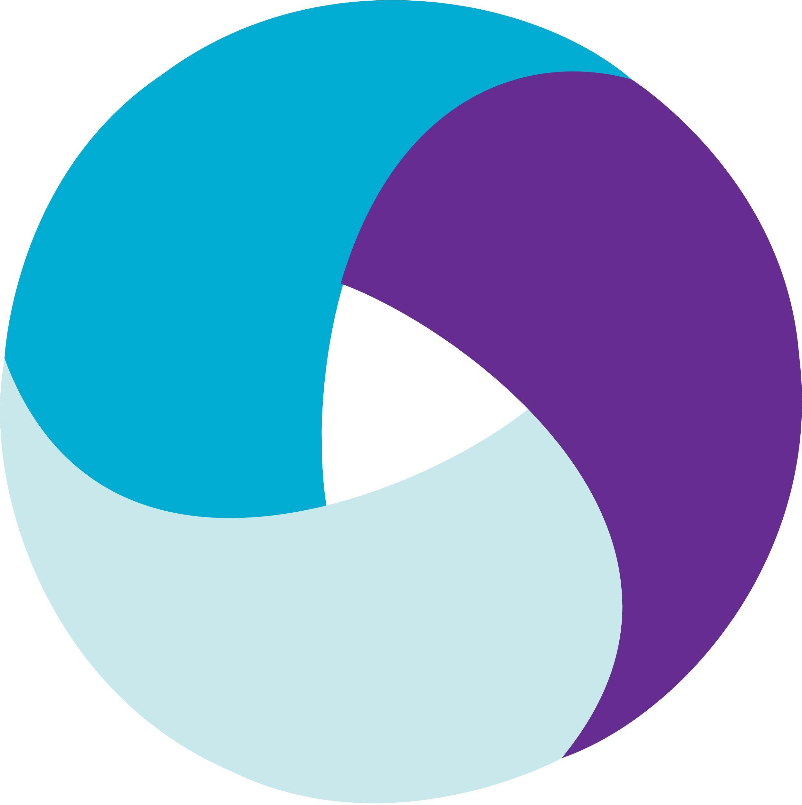

# Автоматизация приложения Wikipedia


## :bookmark_tabs: Содержание:
+ [Стек технологий](#Стек-технологий)
+ [Реализованные проверки](#Реализованные-проверки)
+ [Команды запуска автотестов](#Команды-запуска-автотестов)
+ [Сборка в Jenkins](#Сборка-в-Jenkins)
+ [Пример Allure-отчета](#Пример-Allure-отчета)
+ [Уведомление в Telegram о результатах прохождения тестов](#Уведомление-в-Telegram-о-результатах-прохождения-тестов)
+ [Видеопример прохождения тестов](#Видеопример-прохождения-тестов)
  
### :wrench: ***Стек технологий***
<p>





</p>

### :ballot_box_with_check: ***Реализованные проверки***
При запуске локально:
- Корректность открытия главной страницы
- Проверка перехода на вторую страницу onboarding screen
- Пропуск настроек на главной странице
- Поиск статей
- Переход в настройки

При запуске удаленно:
- Поиск статьи
- Проверка ошибки при переходе на статью

### :arrows_clockwise: ***Запуск автотестов***
Команда запуска тестов из терминала локально
```bash
gradle clean local_test -DdeviceHost=local 
```
Команда запуска тестов из терминала удаленно
```bash
gradle clean browserstack_test -DdeviceHost=browserstack
```

### :large_blue_circle: ***Сборка в [Jenkins](https://jenkins.autotests.cloud/job/student-trubanenko-qa_guru_21_android_test_appium/)***

<kbd></kbd>

### :large_blue_circle: ***Пример Allure-отчета***
<kbd></kbd>

### :large_blue_circle: ***Уведомление в Telegram о результатах прохождения тестов***
<kbd></kbd>

### :large_blue_circle: ***Видеопример прохождения тестов***

